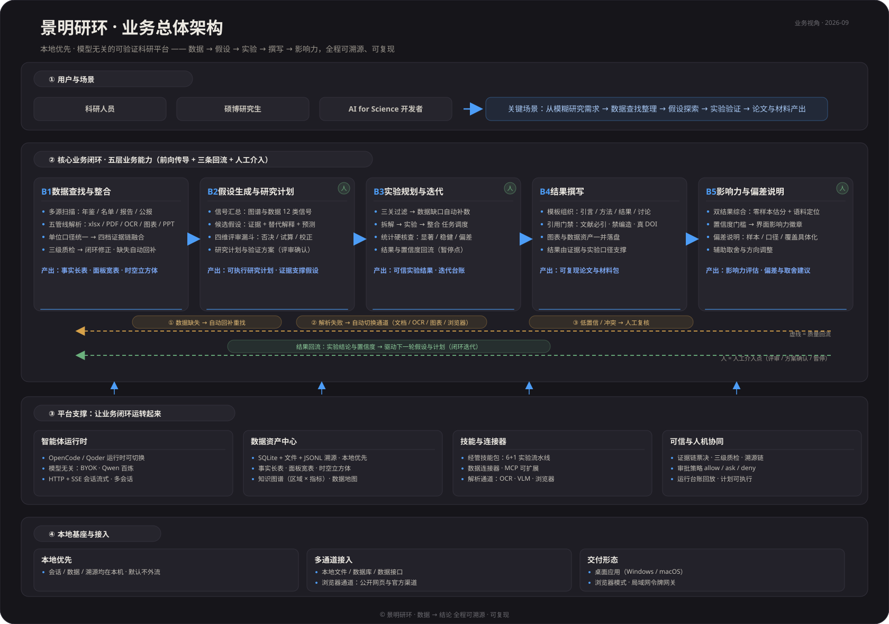

# 景明研环

**本地优先、模型无关的可验证科研平台——科学假设生成与人机协同迭代。**

景明研环把"科研数据整合 → 可验证假设生成 → 实验与迭代"串成一条可审计的闭环：智能体在本地工作区里完成数据查找、解析、整合、分析、绘图与写作，每一步都落下真实、可检查的工件，研究者通过人工确认界面参与决策，全程可复现、可溯源。

## 整体架构（业务视角）



- **① 用户与场景**：服务科研人员、硕博研究生与 AI for Science 开发者；从模糊研究需求出发，走通数据查找整理 → 假设探索 → 实验验证 → 论文与材料产出。
- **② 核心业务闭环（五层）**：数据查找与整合 → 假设生成与研究计划 → 实验规划与迭代 → 结果撰写 → 影响力分析与偏差说明；前向传导之外，质量检查沿三条路径回流（数据缺失自动补数重找 / 解析失败自动切换通道 / 低置信冲突人工复核），实验结果与置信度回流驱动下一轮假设与计划；评审确认、方案确认、暂停点为人机协同介入点。
- **③ 平台支撑**：智能体运行时（OpenCode / Qoder 可切换、模型无关 BYOK）、数据资产中心（SQLite + 文件 + JSONL 溯源链）、技能与连接器（经管技能包 6+1 流水线、MCP 可扩展、OCR / VLM / 浏览器解析通道）、可信与人机协同机制（证据链票决、三级质检、审批策略 allow/ask/deny、运行台账回放）。
- **④ 本地基座与接入**：本地优先（会话、数据、溯源留本机，默认不外流）、多通道接入（本地文件 / 数据库 / 数据接口 + 浏览器公开网页与官方渠道）、交付形态（桌面应用 / 浏览器模式 / 局域网令牌网关）。

## 核心能力

- **数据整合闭环**：从研究需求出发，多源查找（年鉴/名单/报告/附件）→ 五管线解析（xlsx/PDF/扫描件OCR/图表逆向/Word-PPT）→ 字段单位对齐 → 四档证据链投票融合 → 三级质检与闭环修正 → 输出七元组长表、面板宽表、H3时空立方体与溯源链（内置 `packages/data-integration`）。
- **可验证假设生成**：证据约束下的候选假设、四维评审漏斗、统计回路试算与多重检验校正，全部输出标注为候选假设。
- **人机协同迭代**：人工确认、审批策略（allow/ask/deny）、两轮闭环修订与运行台账回放。
- **可插拔模型运行时**：支持 OpenCode 与 Qoder 两类智能体运行时，模型提供方可自由切换；本作品按赛事要求以 Qwen 系列为底座（阿里云百炼）。
- **本地优先**：会话、数据、溯源、运行记录都在本机，默认不外流；令牌网关支持浏览器/局域网访问。

## 快速开始

```bash
pnpm install
pnpm --filter @jingming/desktop tauri dev
```

浏览器模式（无桌面壳）：

```bash
cd apps/desktop && node node_modules/vite/bin/vite.js --port 5174 --strictPort
```

## 仓库结构

- `apps/desktop/` — 桌面/网页前端（Tauri 2 + React + TypeScript）
- `packages/` — `sdk`（运行时客户端）、`shared`、`ui`、`data-integration`（数据整合模块）
- `runtime/` — 智能体运行时管理、sidecar（OpenCode/Qoder）、技能与 MCP
- `docs/` — 设计文档
